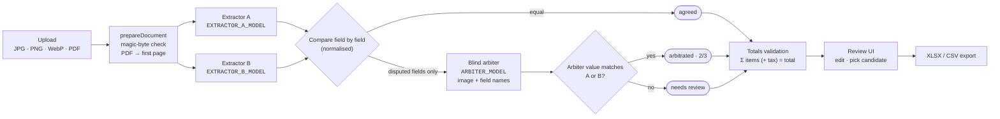
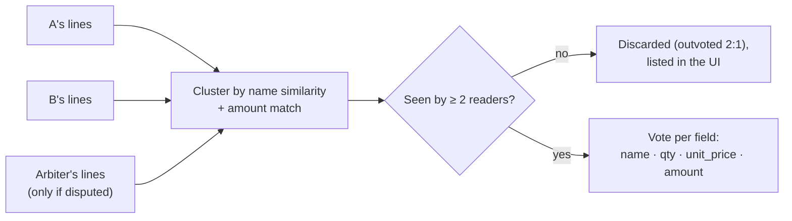
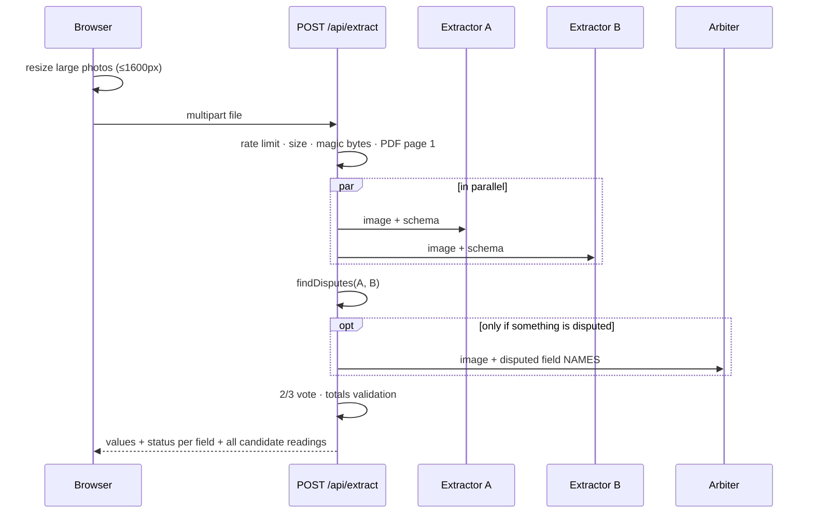

# AI Receipt & Invoice Reader

> Two vision models read every receipt, a **blind** third model breaks ties, and a human only reviews what the machines could not agree on.

Upload receipt or invoice photos (or single-page PDFs). You get structured data (merchant, date, currency, subtotal, tax, total and line items) with a **per-field confidence status**, and you can export it to Excel or CSV. Turkish and English documents are supported.

Built with Next.js (App Router), TypeScript, Tailwind CSS and the Vercel AI SDK. Deployable to Vercel as-is. It runs in a free **demo mode** when no API keys are configured.

<!-- Screenshots: replace the placeholders below with real captures (see docs/screenshots/README.md) -->

| Results overview | Field-level review |
| --- | --- |
| _`docs/screenshots/overview.png`: results table with status badges_ | _`docs/screenshots/review.png`: detail panel with A / B / arbiter readings_ |
| _`docs/screenshots/validation.png`: totals check catching a shared misread_ | _`docs/screenshots/export.png`: coloured XLSX export_ |

---

## Why two models and an arbiter?

Asking one model is fast, but you can't tell *which* fields it got wrong. This project treats extraction as a **voting problem**:

1. **Two independent readers.** Every document goes to two different vision models in parallel (Claude and Gemini by default). Both must answer with the same JSON schema.
2. **Field-by-field comparison.** Values are normalised before comparison: numbers get a tolerance, text is Turkish-aware and accent-insensitive, and dates and currencies are converted to ISO codes. Only real disagreements count.
3. **A blind arbiter, only where needed.** Disputed fields go to a third model call. The arbiter gets the image and the **names** of the disputed fields, but never the values A or B read. Its independent reading decides the field by **2-of-3 majority**.
4. **Humans for the rest.** If all three readings differ, the field is marked **needs review** and the UI asks the user to fix it, with every candidate reading one click away.
5. **Arithmetic as a final check.** Line items + tax must add up to the total. This catches errors that consensus can't, such as when both models misread the same smudged digit.

| Status | Meaning |
| --- | --- |
| 🟢 **agreed** | Both extractors read the same value (after normalisation) |
| 🔵 **arbitrated** | They disagreed; the blind arbiter matched one of them (2 of 3) |
| 🩵 **agreed (fallback)** | An extractor failed; the remaining model and the arbiter model (reading in its place) agree. Only two readers and no third vote, so this is **not** a 2-of-3 consensus |
| 🟠 **needs review** | No majority, so a human decides |
| 🟣 **edited** | Corrected by the user |

## Architecture



Line items cannot be compared by index: models skip, merge or reorder lines. So lines are first **clustered** by name similarity, with a bonus when the amounts match. The vote then happens inside each cluster:



### Request lifecycle



## Design notes

**The arbiter is blind on purpose.** If the arbiter could see A's and B's answers, it would tend to pick one of them instead of reading the document itself. That anchoring would turn the "third opinion" into a tie-breaker that only restates what it was shown. Sending only the field names keeps its vote independent, so a match with A or B is real evidence.

**Correlation risk: the default arbiter shares a family with extractor A.** By default A and the arbiter are both Claude models. Models from the same family often fail the same way: same training data, same tokenizer, similar vision encoder. A shared blind spot can therefore produce a false 2/3 majority for A's mistake. This default was chosen for reading quality, but the trade-off should be visible. You can change it in `.env` without touching code:

```bash
ARBITER_PROVIDER=google          # or anthropic
ARBITER_MODEL=<a model id>       # e.g. a different Gemini tier, or a third vendor once added
```

Using a different model or provider for the arbiter than for A and B reduces the correlation. Adding a third provider only requires another `case` in `lib/providers/index.ts`.

**Single-provider setups weaken the vote further.** Every role can use the same provider, e.g. a Gemini-only setup with one free key. The pipeline works exactly the same, but then all three readers share one vendor's training data, vision stack and failure modes. Agreement between them is weaker evidence, and a 2/3 majority can simply be a shared mistake repeated. If you must stay on one provider, at least pin **three different model versions/tiers** (for example two Flash generations and a Flash-Lite) rather than one model three times. Treat *agreed* and *arbitrated* as less certain than in a mixed-vendor setup. The totals check becomes more important in this case, because it is the only signal that doesn't depend on the models agreeing.

Single-provider setups have a practical downside too: one vendor's capacity problems hit every role at once. In live testing on a free Gemini key, 503 "high demand" errors and quota limits caused extractor failures (handled by the fallback path below) and sometimes both extractors failed on the same document.

**Graceful degradation.**

- The arbiter times out → disputed fields become *needs review*.
- One extractor fails → the arbiter model reads the whole document in its place. The result is explicitly flagged as a **fallback reading** and is never shown as normal consensus:
  - matching fields get their own *agreed (fallback)* status (dashed teal), not *agreed*;
  - the substitute's values are labelled "Arbiter", not as the failed model;
  - a banner in the detail view explains that no blind third vote was possible;
  - the exported status column carries a "fallback reading" note.

  Everything the two readings disagree on is *needs review*.
- Both extractors fail → the request fails with a clear error.

**Tolerances.**

- Numbers: equal if `|a − b| ≤ max(0.01, 0.1 %)`. Printed money is exact, so a looser band would accept real misreads such as `1000` vs `1004`.
- Text: equal if similarity ≥ 0.9 after normalisation. Normalisation is Turkish-aware lower-casing (`İ/ı`), accent folding (`ş → s`), punctuation and legal-suffix removal (`A.Ş.`, `Ltd. Şti.`, `Inc.`).
- Totals: may differ by one cent per line to absorb rounding.

**VAT-inclusive receipts.** Turkish receipts usually print prices *KDV dahil* (tax included). The validator therefore accepts either `Σitems + tax = total` (tax-exclusive) or `Σitems = total` (tax-inclusive), and reports which one it found. Discounts (`İNDİRİM`) are negative line items.

**No model IDs in code.** Providers and model IDs come only from environment variables (`EXTRACTOR_A_*`, `EXTRACTOR_B_*`, `ARBITER_*`), so you can swap models without a code change.

## Privacy

- In live mode, uploaded files are **processed in memory and never written to disk, a database or blob storage**. The API response is marked `Cache-Control: no-store`.
- The document is sent to the configured model providers (Anthropic, Google) for extraction. Their API data policies apply. Review them before processing sensitive documents.
- Server logs contain provider error messages only, never document contents.
- Results live in the browser tab until you export or close it.

## Demo mode

Without API keys (or with `DEMO_MODE=true`), the app replays **recorded model responses** for six bundled sample documents. The responses still go through the real consensus, arbitration and validation code, so the demo shows the actual pipeline at zero cost. Uploads are disabled in this mode.

| Sample | Scenario it demonstrates |
| --- | --- |
| `tr-market` (TR receipt) | Everything agreed. VAT-inclusive totals. Cosmetic differences such as `LTD. ŞTİ.` and `TL` vs `TRY` are normalised away |
| `tr-restaurant` (TR receipt) | B misreads the total and the date; the blind arbiter sides with A → *arbitrated* |
| `en-coffee` (EN receipt) | B skips a line; A and the arbiter both see it → line kept by 2/3 |
| `en-invoice` (EN, 2-page **PDF**) | Ambiguous `01/09/2026` is read three different ways → *needs review*. Only page 1 is processed |
| `tr-cafe` (TR receipt) | Both models make the **same** misread (54 → 45). Consensus can't see it, the totals check does |
| `tr-kirtasiye` (TR receipt) | Extractor B fails (recorded 503). The arbiter model reads in its place → *agreed (fallback)* + one line *needs review* |

> **Honesty note:** the bundled responses are *illustrative*. Each was written to exercise one consensus path deterministically. The sample documents are generated by `scripts/generate-samples.mjs` and every business in them is fictional. To replace a fixture with real recorded outputs from your configured models:
>
> ```bash
> npm run record-fixture -- public/samples/tr-market.png tr-market
> ```

## Getting started

**Requirements:** Node.js 22+ (Node 24 LTS recommended) and npm.

```bash
git clone <your-fork-url> ai-receipt-reader
cd ai-receipt-reader
npm install
cp .env.example .env.local   # leave keys empty for demo mode
npm run dev                  # http://localhost:3000
```

To go live, fill in `.env.local`. Each role picks its own provider, and only the providers you actually use need a key. For example, all three roles can run on Gemini with a single Google key (see the note on independence below).

```bash
ANTHROPIC_API_KEY=...
GOOGLE_GENERATIVE_AI_API_KEY=...

EXTRACTOR_A_PROVIDER=anthropic
EXTRACTOR_A_MODEL=<claude model id>
EXTRACTOR_B_PROVIDER=google
EXTRACTOR_B_MODEL=<gemini model id>
ARBITER_PROVIDER=anthropic
ARBITER_MODEL=<model id>
```

All settings are in [`.env.example`](.env.example), including rate limits, maximum file size, per-call timeout and optional Upstash Redis.

### Scripts

| Command | What it does |
| --- | --- |
| `npm run dev` | Development server |
| `npm run build` / `npm start` | Production build and server |
| `npm test` | Vitest suite: normalisation, consensus, line-item clustering, validation, PDF handling, rate limiting, API route, exports |
| `npm run typecheck` | Route type generation + `tsc --noEmit` |
| `npm run lint` | ESLint |
| `npm run generate-samples` | Re-render the demo documents in `public/samples/` |
| `npm run record-fixture -- <file> <id>` | Record live model outputs as a demo fixture |

## Deploying to Vercel

1. Import the repository in Vercel. The framework (Next.js) is detected automatically.
2. Add the environment variables from `.env.example` in **Project → Settings → Environment Variables**. Leave the keys empty for a public, cost-free demo deployment.
3. **Rate limiting:** the default limiter is in-memory, i.e. per function instance. That's fine for a demo, but serverless instances don't share counters. For a real shared limit, set `UPSTASH_REDIS_REST_URL` and `UPSTASH_REDIS_REST_TOKEN` (e.g. Upstash Redis from the Vercel Marketplace). The limiter switches over automatically and needs no extra dependency.

## Project structure

```
app/
  api/extract/route.ts   POST endpoint: validation, rate limit, pipeline, response
  page.tsx               server component: reads config, passes safe facts to the client
components/              ReaderApp (queue/state), ResultsTable, ReceiptDetail, ExportBar, …
lib/
  schema.ts              Zod schema, the single source of truth for every model
  config.ts              env parsing, live/demo detection
  document.ts            magic-byte sniffing, PDF first-page extraction (pdf-lib)
  pipeline.ts            A ‖ B → disputes → blind arbiter → vote → validation
  consensus/             normalize · compare · lineItems · consensus · validate (pure, tested)
  providers/             env → AI SDK model; extraction and blind arbitration calls
  prompts/               shared reading rules for all three readers
  demo/                  sample list + recorded responses + replay readers
  export/                table model → CSV (RFC 4180, BOM) and XLSX (exceljs, coloured)
  i18n/                  TR / EN dictionaries
  rateLimit.ts           fixed-window limiter (memory or Upstash REST)
scripts/                 sample generator, fixture recorder
tests/                   Vitest suites
```

## Limitations & roadmap

- Only the first page of a PDF is read in v1. Multi-page invoices are on the roadmap.
- HEIC photos are passed through unresized when the browser can't decode them. Converting them server-side is on the roadmap.
- There is no currency conversion or multi-receipt aggregation.
- A third provider (e.g. OpenAI) would make it possible to run three fully independent model families.
- Confidence calibration per field type (e.g. learning which fields each model tends to get wrong) is not implemented.

## License

[MIT](LICENSE)

---

<details>
<summary><strong>Türkçe özet</strong></summary>

**AI Fiş & Fatura Okuyucu**, fiş ve fatura görsellerinden (veya tek sayfalık PDF'lerden) işletme, tarih, para birimi, ara toplam, KDV, toplam ve kalem bilgilerini çıkarır. Sonuçları Excel veya CSV olarak dışa aktarabilirsiniz.

- Her belge iki farklı görü modeline (varsayılan olarak Claude ve Gemini) paralel gönderilir. İki model de aynı JSON şemasıyla cevap verir.
- Alanlar normalize edilerek tek tek karşılaştırılır: sayılar toleransla, metinler Türkçe harf duyarlı biçimde, tarih ve para birimi ISO formatına çevrilerek.
- Uyuşmayan alanlar **kör bir hakeme** gider. Hakem A ve B'nin okuduğu değerleri görmez; yalnızca görseli ve okuması gereken alanların adlarını alır. Hakemin okuduğu değer A veya B ile eşleşirse alan 3'te 2 çoğunlukla kabul edilir.
- Üç okuma da farklıysa alan **"kontrol gerekli"** olarak işaretlenir ve arayüzde elle düzeltilir.
- **Toplam doğrulaması** hem KDV dahil hem KDV hariç fişleri destekler. İki modelin aynı hatayı yaptığı durumları da yakalar.
- **Demo modu:** API anahtarı yoksa kayıtlı cevaplar gerçek konsensüs hattından geçirilir. Maliyet oluşmaz.
- **Gizlilik:** yüklenen dosyalar yalnızca bellekte işlenir, sunucuda saklanmaz.
- **Tasarım notu:** varsayılan hakem A ile aynı aileden (Claude). Aynı ailedeki modeller benzer hatalar yapabildiği için bu tercih korelasyon riski taşır. Hakem `ARBITER_PROVIDER` ve `ARBITER_MODEL` ile `.env` dosyasından değiştirilebilir.
- **Tek sağlayıcı notu:** üç rol de aynı sağlayıcıdan seçilebilir (örneğin tek bir ücretsiz anahtarla yalnızca Gemini). Ancak bu durumda okuyucular aynı eğitim verisini ve aynı hata eğilimlerini paylaşır. Oylamanın bağımsızlığı zayıflar ve 3'te 2 çoğunluk ortak bir hatanın tekrarı olabilir. En azından üç farklı model sürümü/seviyesi seçin ve toplam kontrolüne daha fazla güvenin.

</details>
